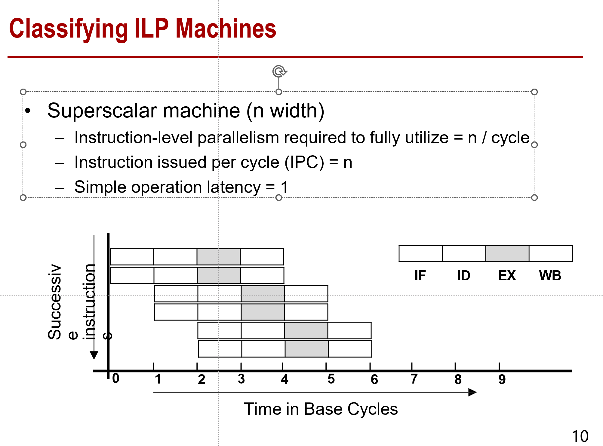
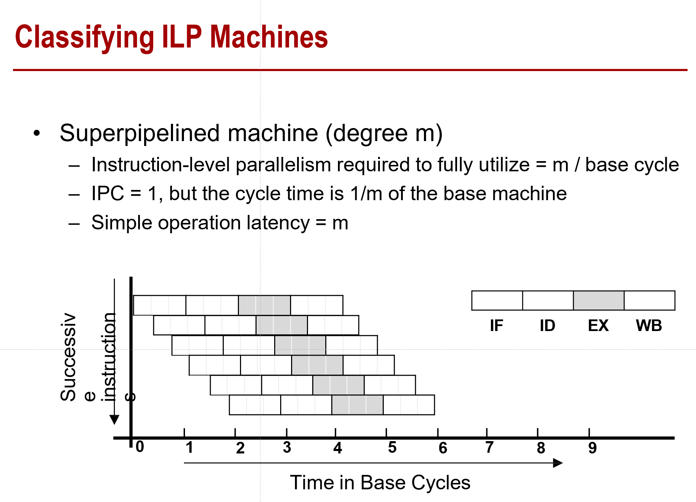
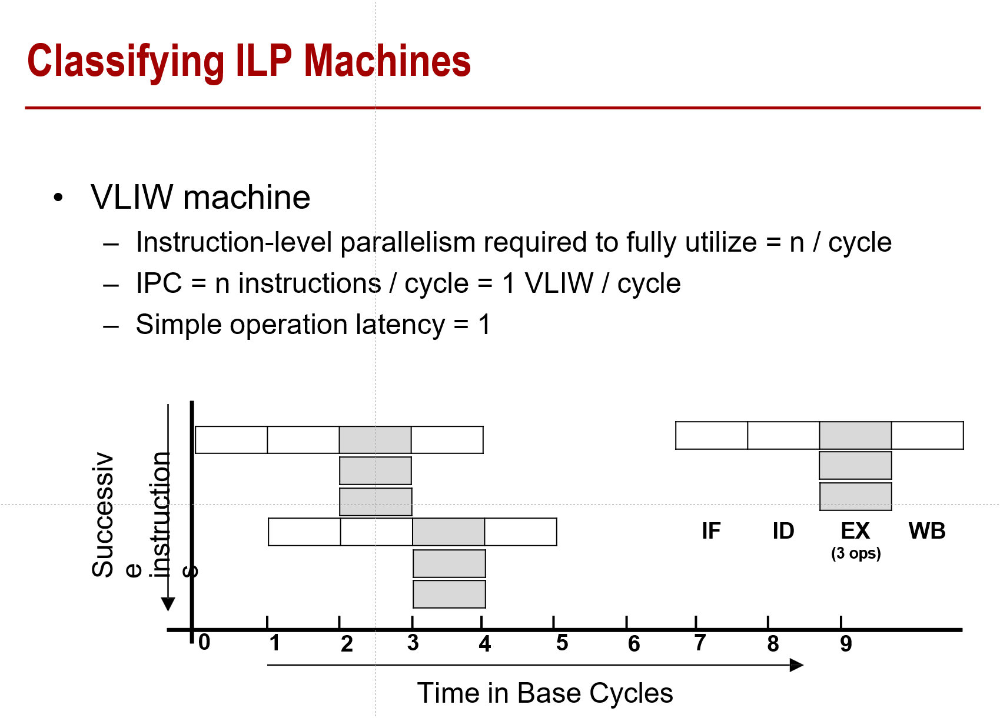

# 计算机体系结构第四章整理

这里想把每一个PPT的知识点都过一下，最好不要漏。

- 几种ILP的method

  - 超标量：每个stage有多个指令并行执行（Superscalar）

    

  - superpipelined：把EX stage切了，相当于流水线的流水线。

    

  - VLIW：相当于一条指令字里面塞了很多个小指令，然后一个同时执行多个EX阶段

    

  - superscalar和superpipelined基本等效，只是时间和空间上的并行性

- 分支预测

  - 静态：编译器可以去预测（比如基于profile数据和给定的数据）
  - 动态：在程序运行的过程中分支条件可能发生变化

- Reorder Buffer(ROB)

  - 指令格式（分支/ld st/ ALU）
  - 存放的寄存器位置/内存位置
  - Value：指令的结果
  
- Tomasulo+ROB

  - 要放到ROB里面来防止各种数据依赖和conflict
  - 感觉这个过程比较难，需要在PPT里面仔细看清楚
  - 感觉得结合一个视频才能看的懂
  
- VLIW

  - Very Long Instruction Word
  - 一条大语句里面有几个操作

- EPIC

  - Explicitly Parallel Instruction Computing
  - VLIW的一个延申

  

  

  