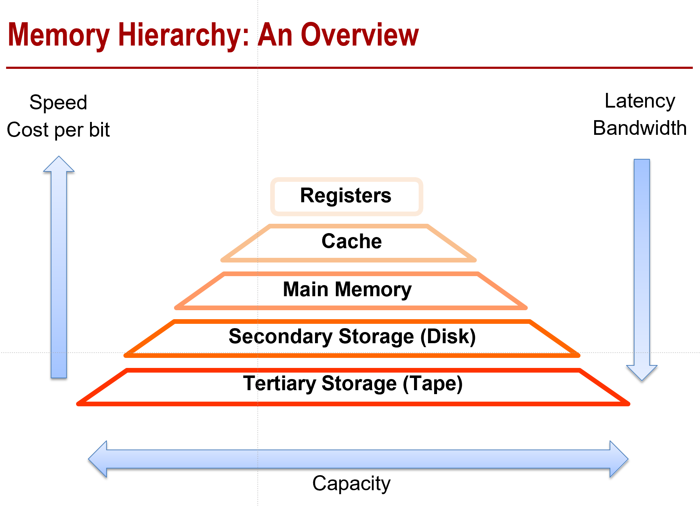
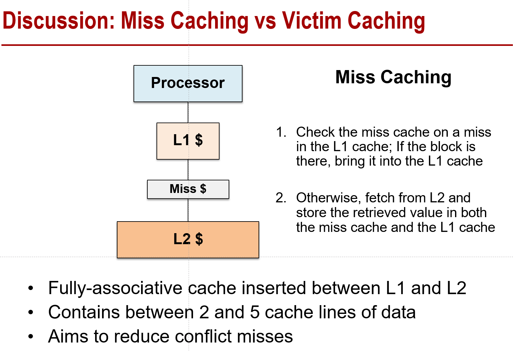
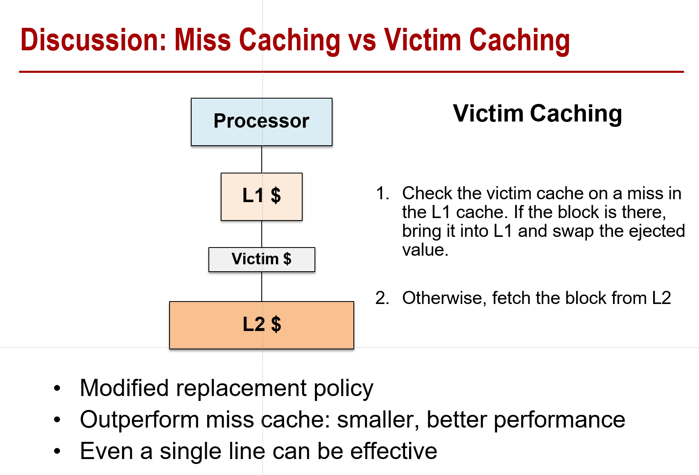

# 计算机体系结构第五章整理

> C5：画出memory层次，cache层次，cache作用， 冯诺依曼+寄存器+L1 L2 L3cache+memory cache优化方式 cache组织方式 miss cache vs victim cache dram架构

这里想把每一个PPT的知识点都过一下，最好不要漏。

- memory层次的overview

  

- cache的组成

  - tag：block的地址
  - status：检验是否有效
  - data：缓存的数据

- 三种相联方式

  - 直接映射：每个cache line 都是一个set
  - 全相联：block可以放在cache的任何位置
  - 组相联：e.g.(4路组相联：每个组里能放四个cacheline)
  
- 虚存

  - 页表：把虚拟页映射到物理页上
  
- 内存/缓存优化

  - 时间局部性
  - 空间局部性
  - 算法局部性

- 缓存的两种cache模式

  - Miss cache相当于就是简单往L1和L2中间插了一个cache，而Victim cache相当于就是当一个buffer，把L1旧的value存下来，方便L1来换
  
- Miss Caching
  
  
  
- Victim Caching
  
    
  
- cache hit的时候写的policy

  - Write-back（写回）：lazy的方式，modify暂时只写到cache上，在替换的时候才把脏块写到memory里
  - Write-through（写直达/写穿）：对cache和对memory一起写

- cache miss的时候写的policy

  - Write allocate：将主存的block带到cache上并且更新
  - no-write allocate：write miss不影响cache，直接写主存

- DIMM（Dual in-line memory module）层次架构

  - 每一个DIMM有一个或多个rank
  - 每一个rank有一组DRAM Devices
- 每一个DRAM device有一个或多个bank
  - 每一个bank有一些memory array

- 一些DRAM的其它知识

  - Channel：MC和DRAM module之间的通道，也就是平时说的多少通道内存
  - Dram chips上的xN表示DRAM至少有N个memory array在一个bank上，并且每一个列的宽度都是Nbits（一次传输N bits data）

- Synchronous DRAMs（SDRAM）

  - 用始终取代行和列上的RAS和CAS，获得更高数据传输率
  
- Double Data Rate(DDR) SDRAM

  - 数据在一个时钟的两个沿（上升/下降）均会传输
  

  

  
