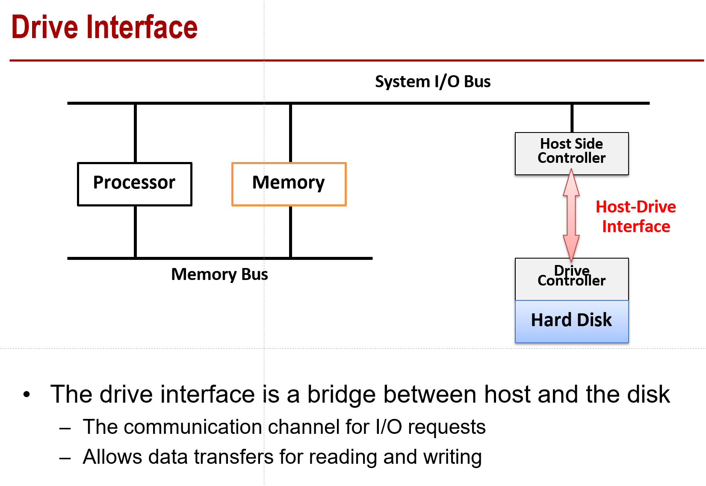
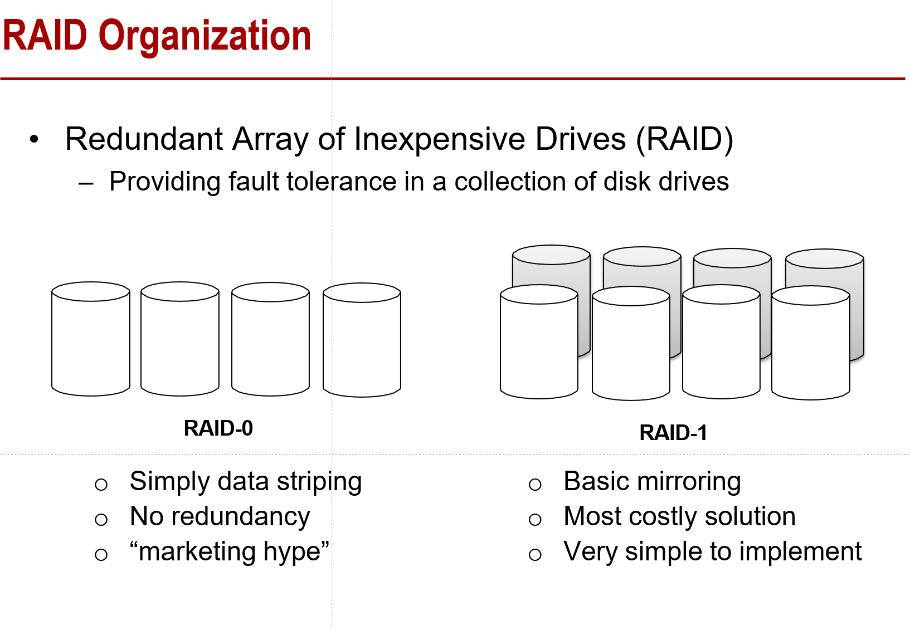

# 计算机体系结构第六章整理

> C6：IO BUS MEM BUS P11 3-5pt

这里想把每一个PPT的知识点都过一下，最好不要漏。

- IO Bus

  - 上课的时候，说基本把第十一页的PPT过一遍就差不多了

  - memory总线是处理器和memory之间的，而IO bus是meory，处理器和磁盘之间的

    

- RAID （Redundant Array of Inexpensive Drives）

  - 在disk drives之间组raid可以获得容错性
  
- RAID 0 vs RAID 1

  ​	

- RAID的其它感觉有点难，先不管了。

  

  

