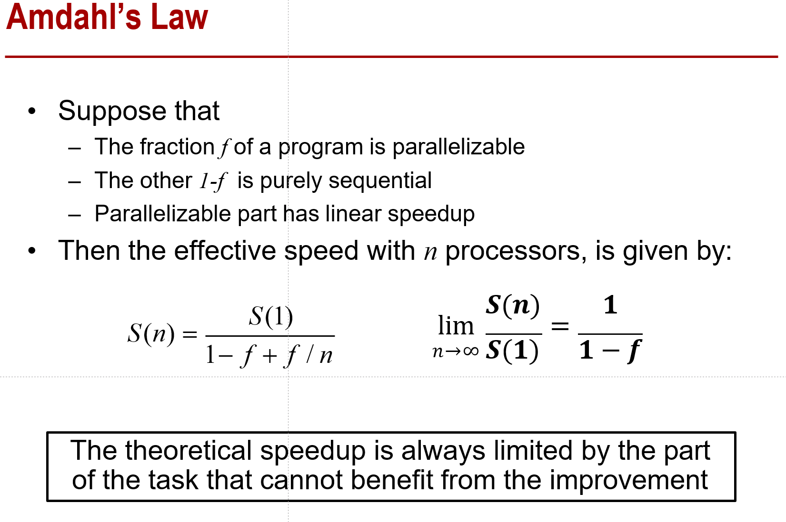
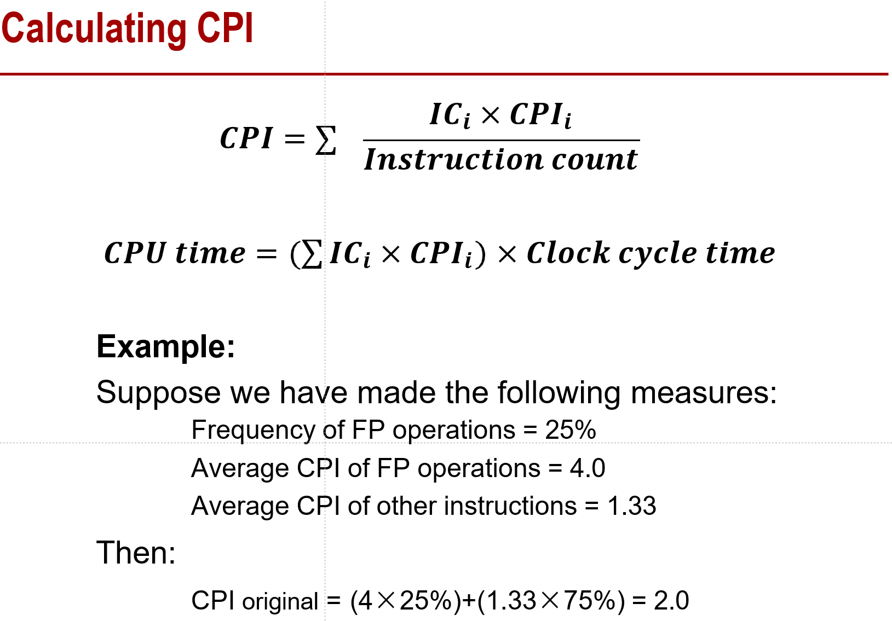

# 计算机体系结构第七章整理

这里想把每一个PPT的知识点都过一下，最好不要漏。

- 阿姆达尔定律

  - 其实就是一个并行和串行时间的比较

    

    

- 计算CPI

  ​	

- Functional Simulation

  - 只对ISA的特征建模
  - 可以用来生成指令和地址trace，用来给其它模拟工具做输入

- Trace-Driven Simulation

  - 把指令和地址的trace放入一个微架构timing simulator里面模拟
- 把功能simulation和计时simulation分离开
  
  - 缺点是需要trace file，以及在mis-predicted paths上不能有效做预测
  
- Execution-Driven Simulation

  - 目前通用的simulation
- 把功能simulation和时间simulation结合在一起，并且准确度比Trace-Driven更高
  - 缺点是要更多的开发/evaluation时间
  - Example: SimpleScalar GEMS Simis M5 PTLSim GPGPU-Sim
  
  
  
  
  
  

