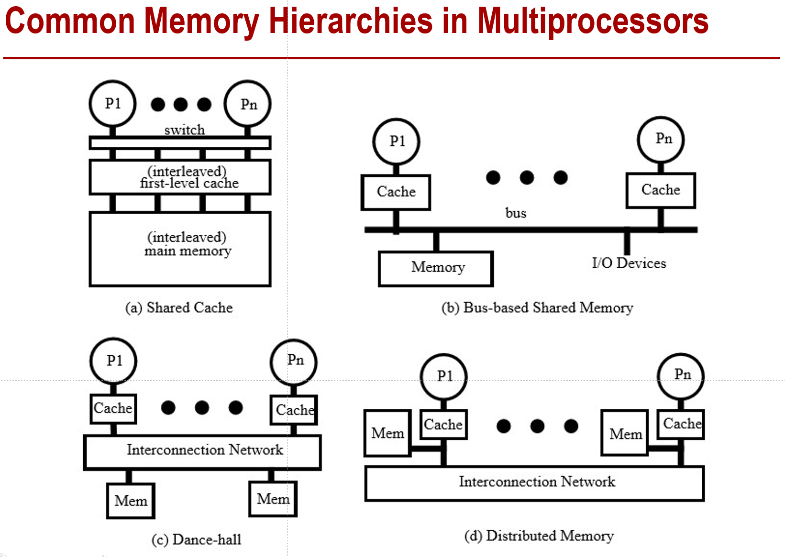
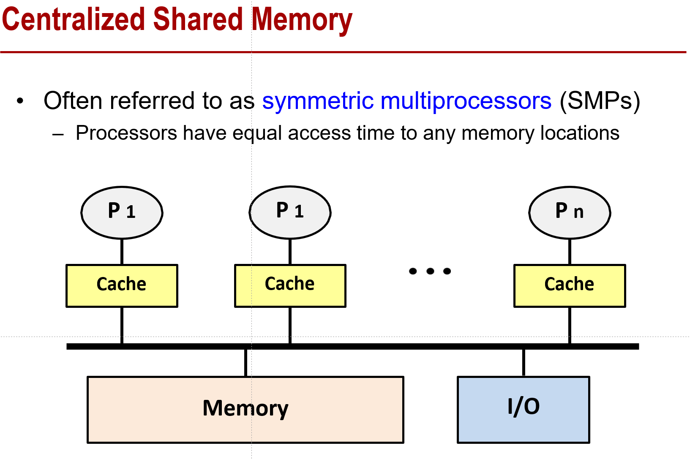
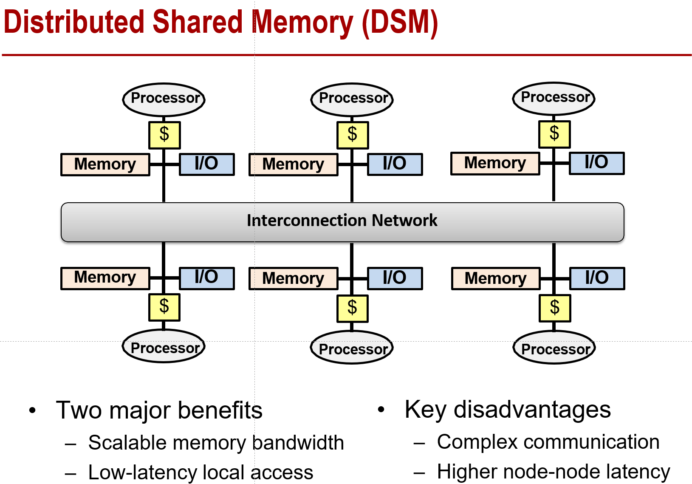
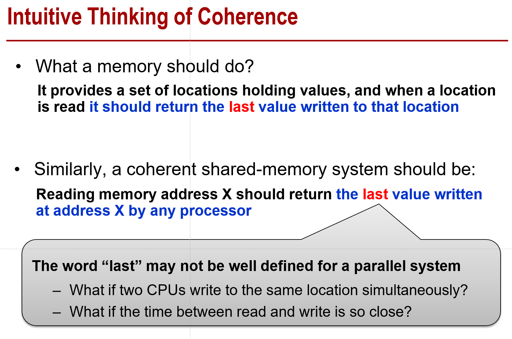
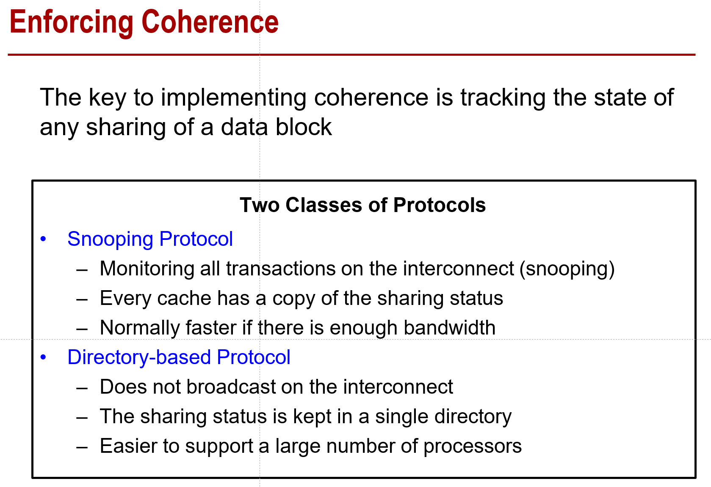

# 计算机体系结构第八章整理

这里想把每一个PPT的知识点都过一下，最好不要漏。

- Flynn分类

  - SIMD：Single Instruction Single Data：一组指令执行在一组数据上
  - SIMD：Single Instruction Multiple Data：一组指令执行在多组不相交的数据上
  - MISD：Multiple Instruction Single Data：目前没有
  - MIMD：Multiple Instruction Multiple Data：每个计算节点对于自己的数据执行自己的指令流

- 几种具有代表性的并行

  - 指令级并行：前几章的内容有谈过，比如超标量之类的
  - 线程级并行：对于多处理器的架构，在多个处理器上做并行（比如OpenMP等）
  - 数据级并行：在多核的加速卡（如GPU）上做并行（比如CUDA）
  - 任务级并行：在集群中有多个任务一起处理

- 多处理器的经典内存架构

  

- UMA vs NUMA （Uniform memory access & Non-uniform memory access）

  - UMA：Centralizaed shared-memory 多个处理器共享同一个物理内存
  - NUMA：distributed shared-memory 每个processor对应的物理地址是分开的
  
- Centralized Shared Memory

  - 经常被成为SMP（symmetric multiprocessors），类比同一个NUMA下的processor访存

    

- Distributed Shared Memory (DSM)

  - 类比GPU卡上的，每一个processor都会有自己的private memory，并且processor间通信靠片上的互连网络

    

- Cache一致性问题
  
  - local和shared的data都存在，对于每一个processor，看到的值可能不一样
  - 一致性需要的几个原则：
  
  

- 基本的condition

  - Program Order：需要做到Read After Write，即对同一个处理器，每次读的时候都是读到最新的值
  - Write Propagation：对一个值的写可以最终传到其它处理器上：比如P2写的一个值，P1肯定能够读到
  - Write Serialization：对于同一个位置的写要做到串行，比如P1和P2都要写一个值，那么在所有处理器中，看到这两个写的顺序都要是一样的

- Coherence vs Consistency

  - Coherence：一致性，强调读出值的异同
  - Consistency：一贯性，强调读的时间概念

- Snooping Protocol

  

- Snooping Protocol定义

  - 所有对于mem的写会变成事务，这个事务对于每一个processor的local cache是可见的。（类似于他们会去snoop mem bus）
  - 发生读请求时，cache会同时衡量processor传来的请求，以及之前总线上面已有的事务，并且得出结果。

  

  

  

  

