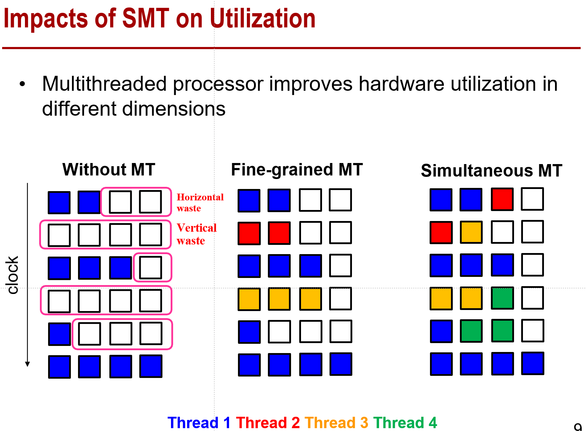
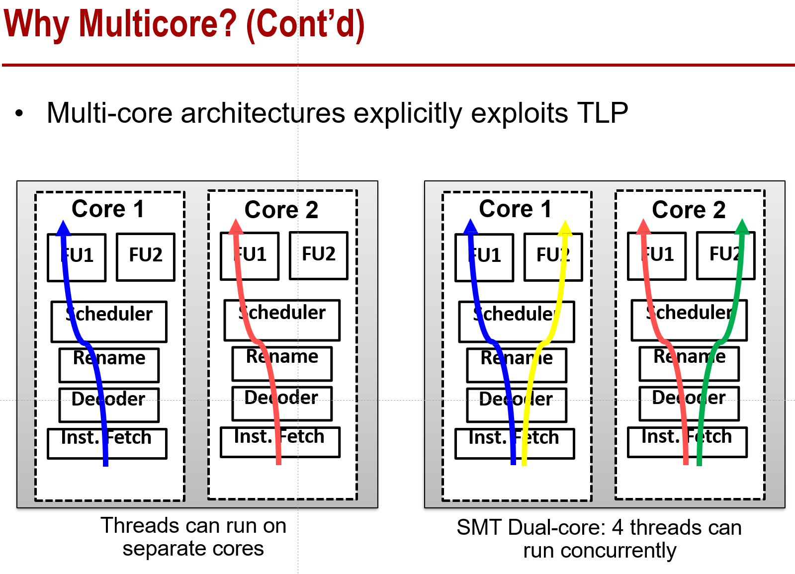
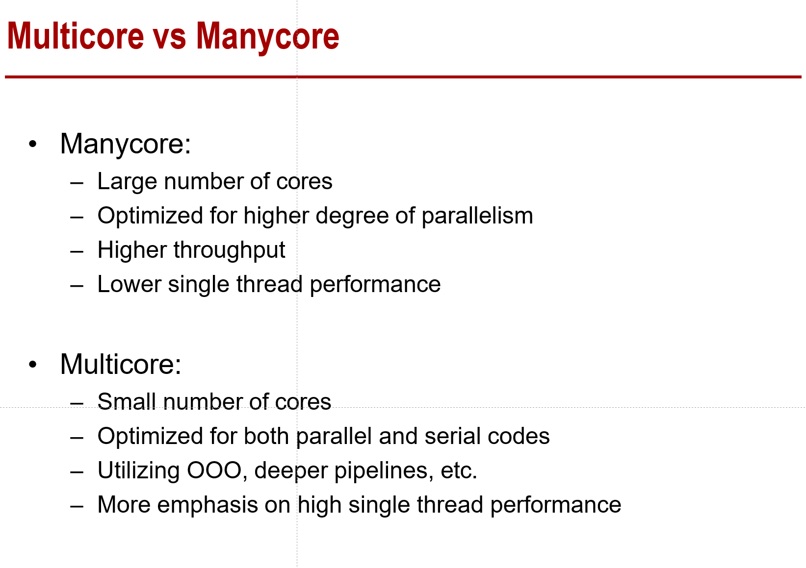
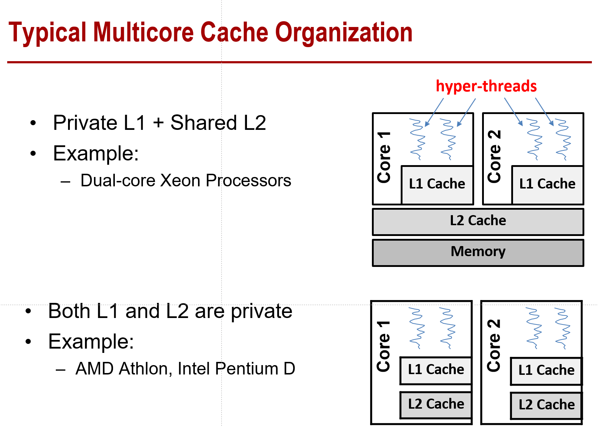

# 计算机体系结构第九章整理

这里想把每一个PPT的知识点都过一下，最好不要漏。

- 线程级并行（TLP）定义

  - 线程代表着一个处理器使用的最小处理单元
  - 每一个线程的操作都是parallel的

- 几种多线程并行

  - Fine-grained（interleaved） multithreading：在每个clock cycle都会做线程切换

  - Coarse-grained multithreading：当latency比较长的时候，会做线程切换

  - Simultaneous multithreading (SMT)：在同一个cycle，指令可能从不同的thread发过来

    

- 多核让TLP更充分的被使用（比如两个核的）

  

  

- 多核+SMT的好处

  - 更加充分利用了TLP
  - 让更多的core集成到同一个片上
  - 在一个高效的频率上用更多的core
  
- Multicore vs Manycore

  

- 之前的一个CPU+存储层次结构

  

  

  

  

  

  

